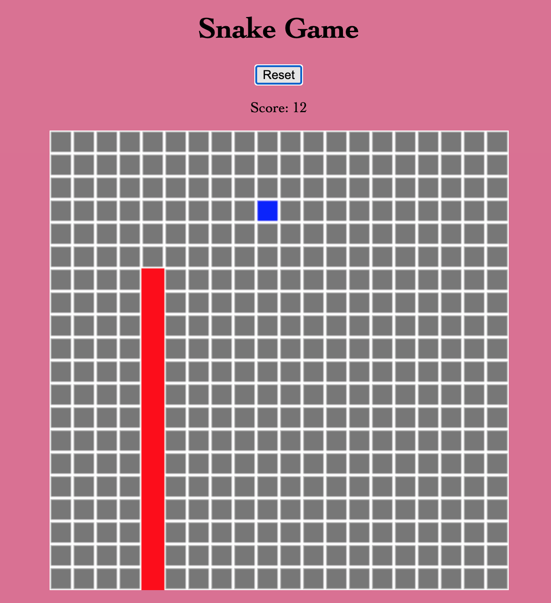

# _Classic Snake Game_

_9 March 2020_

#### _Become a snake. Eat food. Don't die._

#### By _**Vanessa Stewart**_

## Description
Use the arrow keys to move the snake to food tiles. Don't collide into walls or the snake body itself.

## Setup/Installation Requirements
To View Project:
* Open a web browser of your choice and navigate to the following page: https://vanmars.github.io/snake-game/

To Extend This Project:
* Clone this project using the `git clone` command in terminal.
* Open the cloned repo in a text editor of your choice.

## Known Bugs

_There are no known bugs at this time._

## Support and Contact Details

_Connect with me at vamariestewart@gmail.com with ideas to improve this project._

## Technologies Used

* HTML
* CSS
* JavaScript

### License

Copyright (c) 2021 **_Vanessa Stewart_**

Permission is hereby granted, free of charge, to any person obtaining a copy of this software and associated documentation files (the "Software"), to deal in the Software without restriction, including without limitation the rights to use, copy, modify, merge, publish, distribute, sublicense, and/or sell copies of the Software, and to permit persons to whom the Software is furnished to do so, subject to the following conditions:

The above copyright notice and this permission notice shall be included in all copies or substantial portions of the Software.

THE SOFTWARE IS PROVIDED "AS IS", WITHOUT WARRANTY OF ANY KIND, EXPRESS OR IMPLIED, INCLUDING BUT NOT LIMITED TO THE WARRANTIES OF MERCHANTABILITY, FITNESS FOR A PARTICULAR PURPOSE AND NONINFRINGEMENT. IN NO EVENT SHALL THE AUTHORS OR COPYRIGHT HOLDERS BE LIABLE FOR ANY CLAIM, DAMAGES OR OTHER LIABILITY, WHETHER IN AN ACTION OF CONTRACT, TORT OR OTHERWISE, ARISING FROM, OUT OF OR IN CONNECTION WITH THE SOFTWARE OR THE USE OR OTHER DEALINGS IN THE SOFTWARE.